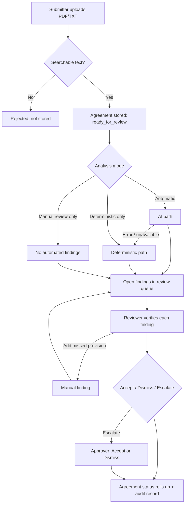

# How submitted agreements are reviewed

This note explains what happens to an agreement after a submitter uploads it: the three
analysis paths (AI, deterministic, and manual), how each finding gets its confidence score,
and how a human reviewer turns findings into a final decision.

All three paths do the same narrow job. They report that a named provision appears to be
**present** and quote the agreement text that shows it. None of them extracts values, rates
risk, compares against a standard, or decides anything. Every finding waits for a person.

## 1. Intake steps shared by every path

1. **Choose a file and an analysis mode.** On *New intake* the submitter picks a searchable PDF
   or TXT (10 MB max), the agreement type, the business unit, a needed-by date, and one of:
   - *Automatic: AI → deterministic fallback* (default)
   - *Deterministic only*
   - *Manual review only*
2. **Extract and validate text in the browser.** `extractDocumentText` (`src/lib/analyze.ts`)
   reads TXT files directly and runs PDF.js on PDFs, prefixing each page with `[Page N]`. Files
   with fewer than 40 characters of real text (image-only scans), password-protected PDFs, and
   other file types are rejected. **A rejected file is not stored.**
3. **Store the file and create the agreement.** The file is uploaded, and the agreement is
   created with an audit event. Its status is `manual_review_required` in Manual mode and
   `ready_for_review` otherwise.
4. **Run the chosen analysis.** `analyzeExtractedText` (`src/lib/analyze.ts`) runs the selected
   path against the playbook rules for the chosen agreement type. Only rules marked active are
   used.
5. **Save findings.** Findings are saved as `open`, with an *Analysis completed* audit event that
   records the method used, the number of findings, and the duration. If analysis throws for any
   reason, the agreement is kept with zero findings and routed to manual review.

## 2. The AI path

Used when the mode is **Automatic**.

**In the browser** (`runAiAnalysis`, `src/lib/analyze.ts`):

- Splits the text into sections of at most **120,000 characters** (`src/lib/chunkText.ts`).
  Sections end at a paragraph or sentence break where possible and overlap by 2,000 characters,
  so a clause on a boundary appears whole in one section. Short agreements are one section.
- Sends each section, with the signed-in user's access token, the agreement type, and each
  active category's taxonomy `description` and `exclusions`, to `POST /api/analyze`, three
  sections at a time.
- Merges the returned findings, dropping the same category and span returned from two
  overlapping sections.
- If any section fails, the whole AI run is treated as unavailable and the deterministic path
  runs on the full text, so a partial AI result never silently misses provisions. Agreements
  that need more than 12 sections (about 1.4 million characters) skip the AI path and go to
  deterministic analysis with the notice *"The agreement is too long for AI analysis, so
  deterministic analysis ran on the full text."*

**On the server** (`api/analyze.js`):

1. Rejects the request unless it comes from a signed-in Supabase user, names one of the 7 allowed
   agreement types, and has at least 40 characters of text. Drops any category not in the list
   of 10 allowed categories.
2. **OpenAI extractor** (if `OPENAI_API_KEY` is set; model `OPENAI_MODEL`, default
   `gpt-5-mini`). The prompt tells the model to apply each definition and exclusion and to return
   only categories it can support with text copied exactly from the agreement. A strict JSON
   schema allows only `{ provision, present: true, sourceText }`, so the model cannot report
   absence, severity, or its own confidence.
3. **CUAD classifier** (backup, if `CUAD_CLASSIFIER_URL` is set). This is a separate,
   experimental question-answering service (`classifier-service/app.py`). It splits the
   contract into 4,500-character chunks that overlap by 500 characters, asks a CUAD-style
   question for each category, keeps the best answer, and reports it only if the model score
   is at least `CUAD_CONFIDENCE_THRESHOLD` (default 0.50). The model score itself is not
   returned.
4. If neither service is configured or both fail, the server returns 503.

**Back in the browser**, every returned finding is checked:

- Kept only if its `sourceText` appears word-for-word in the document (ignoring spacing and
  capitalization). Quotes the model made up are dropped.
- The deterministic path is then run on the same text as an independent cross-check, which sets
  the confidence score (section 5).

**Fallback:** an HTTP error, invalid response, or network failure makes the browser run the
deterministic path instead. The submitter sees *"AI was unavailable, so deterministic analysis
ran automatically."* A successful AI response with **zero** findings does **not** trigger the
fallback.

## 3. The deterministic path

Used when the mode is **Deterministic only**, or automatically when the AI path fails. This path
runs entirely in the browser. It makes no network calls, and the same input always gives the
same output.

1. **Pick categories.** Keep the taxonomy entries (`src/data/cuad-calder-taxonomy.json`) whose
   `contractTypes` include the agreement type, limited to active playbook rules. If the playbook
   is empty, every category for that type is checked.
2. **Split the contract into segments** (`segmentContract`, `src/lib/candidateRetrieval.ts`).
   Split at blank lines, and after `.`, `;`, `!`, or `?` when the next text starts with a numbered
   item, a lettered item, or a capital letter. Drop pieces shorter than 20 characters. Each segment
   is widened to include the segment before and after it.
3. **Score segments.** For each category, count how many of its `candidatePhrases` appear in the
   segment (case-insensitive substring match; each phrase counts once).
4. **Pick the best segment.** The highest score wins; ties go to the longer segment (counted up to
   700 characters). The quoted text is cut to 900 characters. A category with no matching
   segment produces no finding.

Taxonomy `exclusions` are **not** applied on this path; they are only sent to the AI.

## 4. The manual path

Used when the mode is **Manual review only**, when analysis fails, and whenever a reviewer
needs to add something automation missed.

- Manual mode creates the agreement with **no findings** and status `manual_review_required`.
  Any agreement whose automated analysis produced no findings (the analysis failed or nothing
  matched) also shows as `manual_review_required`, so it is clear someone must identify
  provisions by hand.
- In the queue, a reviewer (reviewer, approver, or administrator role) uses **Add manual
  finding** to record:
  - **Provision**: chosen from the playbook categories for the agreement type.
  - **Confidence**: a number from 0 to 100 (default 100; 0 is kept as 0).
  - **Exact source text**: required, and checked against the agreement. The app reloads the
    uploaded file, extracts its text, and blocks the finding if the quote is not in it
    (ignoring spacing and capitalization). If the file cannot be loaded, the finding is
    saved with a warning, and the audit entry records that the quote was not verified.
  - **Reviewer note**: optional.
- The finding is saved as `open` with `analysisMethod: "manual"` and goes through the same
  review steps as automated findings.
- **Add manual finding** stays available until the agreement's review is complete, so it also
  covers provisions missed in AI and deterministic results.

## 5. How the confidence score is calculated

Confidence is a 0–100 number calculated by the application. It is never a model's own
self-reported certainty.

| Method | Score | How it is determined |
|---|---|---|
| AI, cross-checked | **90** | The quote was found in the document **and** the deterministic path independently found the same category. |
| AI only | **75** | The quote was found in the document, but the deterministic path did not find that category. |
| Deterministic | **64–96** | `min(96, 60 + 9 × matched phrases + 4 if the segment is over 100 characters)` |
| Manual | **Reviewer-entered** | The value typed in *Add manual finding* (0–100); 100 if left blank. |

Deterministic scores by number of matched phrases:

| Matched phrases | Segment ≤ 100 chars | Segment > 100 chars |
|---|---|---|
| 1 | 69 | 73 |
| 2 | 78 | 82 |
| 3 | 87 | 91 |
| 4 or more | 96 | 96 (cap) |

The AI cross-check compares **categories**, not quotes. A score of 90 means the deterministic
path found that category somewhere in the agreement, possibly in a different clause from the
one the AI quoted.

### The 85 threshold

Findings below **85** are marked low-confidence: they show a red flag count and are counted in
the Overview's *Low-confidence open* tile, and the priority queue puts them first when due dates
tie. Confidence only affects how prominently a finding is shown; **no finding is ever hidden
because of its score.** For why the threshold is 85 and the measured miss rate for each
category, see [CONFIDENCE_THRESHOLD_NOTE.md](CONFIDENCE_THRESHOLD_NOTE.md).

Confidence describes how well supported a finding is. It says nothing about provisions that
were never found. A missing finding does not mean the provision is absent.

## 6. Human review and final status

Reviewers work the review queue. For each open finding they read the quoted source text, confirm
the category, and record a decision with a **required reason**:

- **Accept**: the provision is present as quoted.
- **Dismiss**: the finding is wrong or not relevant.
- **Escalate to Approver**: an approver should decide.

Approvers and administrators resolve escalated findings by accepting or dismissing them. An
escalated finding cannot be escalated again. Every decision and its reason are written to the
audit log.

After each decision, the agreement status is recalculated from its findings
(`agreementReviewStatus`, `src/lib/data.ts`):

| Findings | Agreement status |
|---|---|
| Any finding escalated | `escalated` |
| All accepted | `approved` |
| All accepted or dismissed (at least one dismissed) | `review_complete` |
| Some decided, some still open | `in_review` |
| No findings at all | `manual_review_required` |
| None decided yet | unchanged (usually `ready_for_review`) |

`cleared_with_conditions` is recorded in history but not yet produced by a workflow action; see
[DECISION_AND_AMBIGUITY_LOG.md](DECISION_AND_AMBIGUITY_LOG.md).

## 7. Known gaps

- **Manual quotes can't always be verified.** In local demo mode uploaded files are not kept,
  so a quote can only be checked during the session that submitted the agreement. In Supabase
  mode the check runs in the browser; a direct database write could skip it.
- **Status for zero-finding agreements is derived.** Submitters cannot update agreement rows,
  so an agreement whose analysis found nothing keeps `ready_for_review` in the database and is
  shown as `manual_review_required` from its findings.
- **Empty playbook.** With no active rules, the deterministic path checks every category, but
  the AI path sends none and returns no findings (and so does not fall back).
- **Long contracts.** The AI path analyzes up to 12 sections of 120,000 characters (about 1.4
  million characters); longer agreements use deterministic analysis only. Each section is
  analyzed without the rest of the contract as context, and the server rejects any single
  request over 120,000 characters.
- **Deterministic matching is literal.** It ignores word boundaries and negation, so "renew"
  also matches inside "non-renewal".
- **The AI path is not covered by the CUAD evaluation.** The evaluation harness scores only the
  deterministic path; see [evaluation/README.md](../evaluation/README.md).
