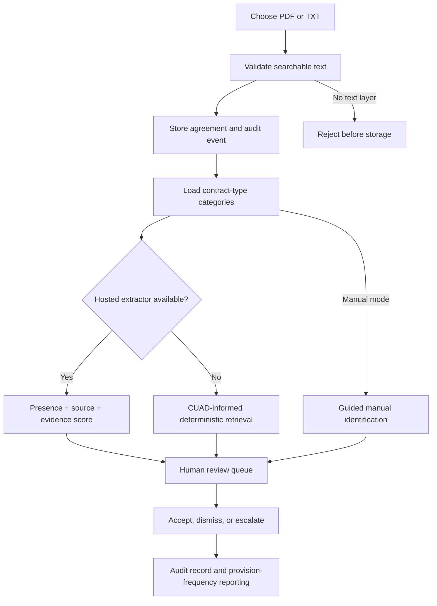
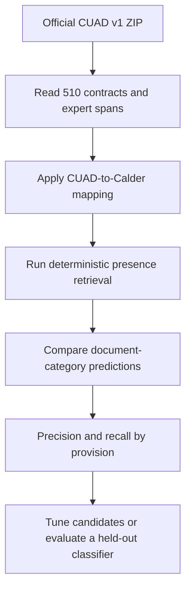

# Calder architecture and workflow

## Responsibility boundaries

| Component | Required responsibility | Explicitly excluded |
|---|---|---|
| Contract-type playbook | Select active provision categories for Calder's seven requester-declared agreement types | Inferring agreement type or treating an unfound category as absent |
| PDF.js ingestion | Extract searchable text from PDF/TXT files in the browser | OCR for image-only PDFs |
| Hosted extractor | Return presence and exact source text; the application derives confidence from verifiable evidence | Values, severity, deviations, gaps, legal advice, model self-confidence |
| Deterministic retrieval | Find CUAD-informed candidate clauses from searchable text | Final legal or risk judgment |
| Human reviewer | Verify category/source and accept, dismiss, or escalate | Silent automated disposition |
| Audit/reporting | Preserve actions and count provision frequency | Reporting against undocumented standards |

## Runtime workflow

Submission and analysis are separate workflow steps and database mutations. Searchable-text validation happens first so a scan is rejected before storage; the agreement and intake audit event are then created before analysis begins. The agreement therefore survives a hosted-analysis failure and remains available for deterministic or manual review.

## Hosted extraction order

1. If `OPENAI_API_KEY` is configured, the authenticated Vercel route uses a general-purpose model with the CUAD-informed definition, exclusion criteria, and a strict presence/source schema.
2. If that extractor is unavailable and `CUAD_CLASSIFIER_URL` is configured, the same route may call the separate CUAD-trained experimental service.
3. If neither hosted path succeeds, the browser automatically runs deterministic retrieval.
4. A reviewer can always add or correct a source-linked finding manually.

The browser never receives the classifier token or OpenAI key.

## Evaluation workflow

CUAD is used locally; contract text is not sent to an external service by the evaluation harness.

The optional CUAD-trained service is not the recommended reported model path because a model trained on CUAD cannot be fairly scored on the same contracts. It stays isolated and disabled unless the team creates a documented held-out evaluation design.
